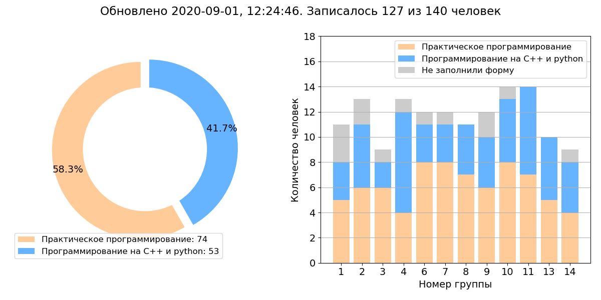

Добро пожаловать на страницу курса "Программирование на C++ и python" для студентов второго курса [физического факультета](http://phys.nsu.ru) [Новосибирского государственного университета](https://www.nsu.ru)!

В рамках этого курса студенты получают начальные навыки программирования на языках C++ и python, представление об инструментах контроля версий и совместной разработки ПО, осваивают популярные библиотеки для научных вычислений и визуализации данных. Подробнее [о курсе](about).

## Запись на альтернативные дисциплины

[Форма для записи](https://forms.gle/YqouV8b7UKJmCKGr6)

Текущая статистика:

## Разделы сайта

* [Программа лекций](lectures)
* [Программа практических занятий](seminars)
* [Задания](problems)
* [Материалы к практическим занятиям](textbook)
* [Вопросы и ответы](qna)
* [Команда курса](team)
