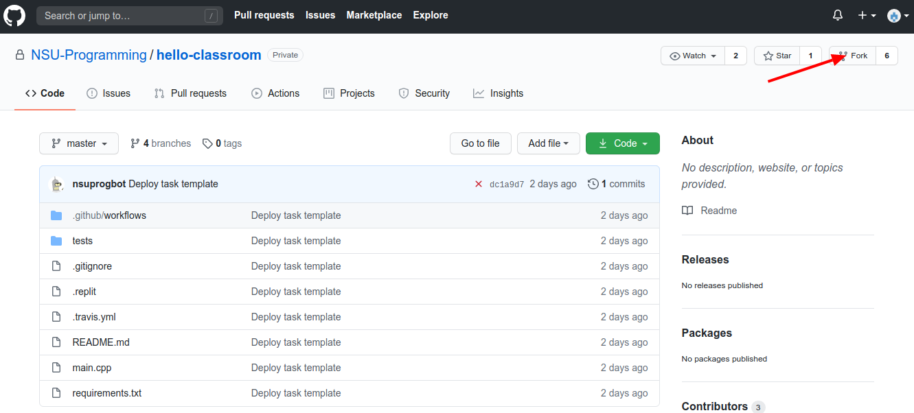
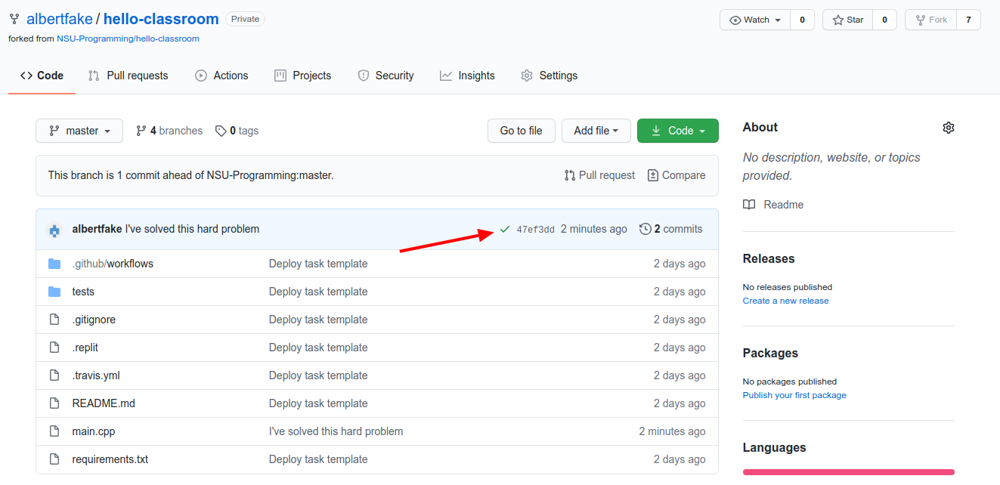
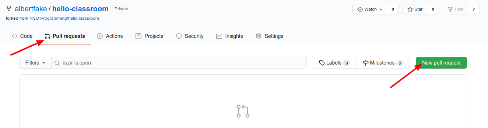
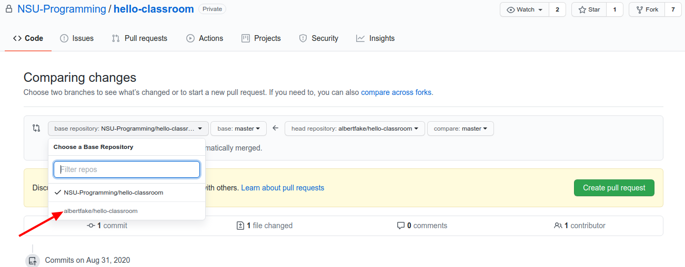
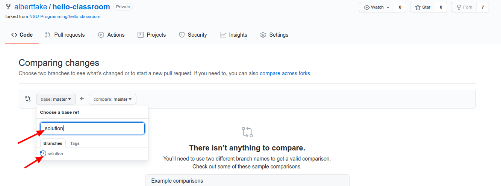
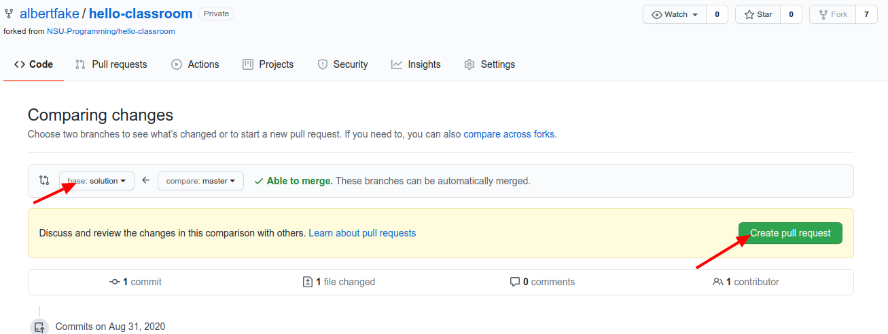
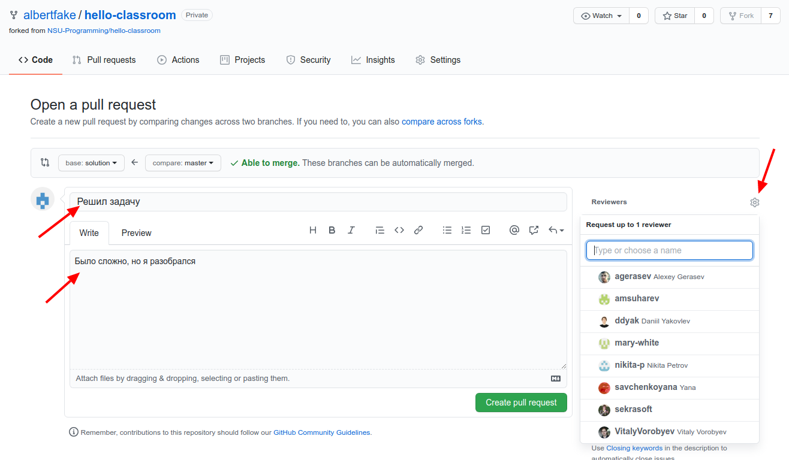
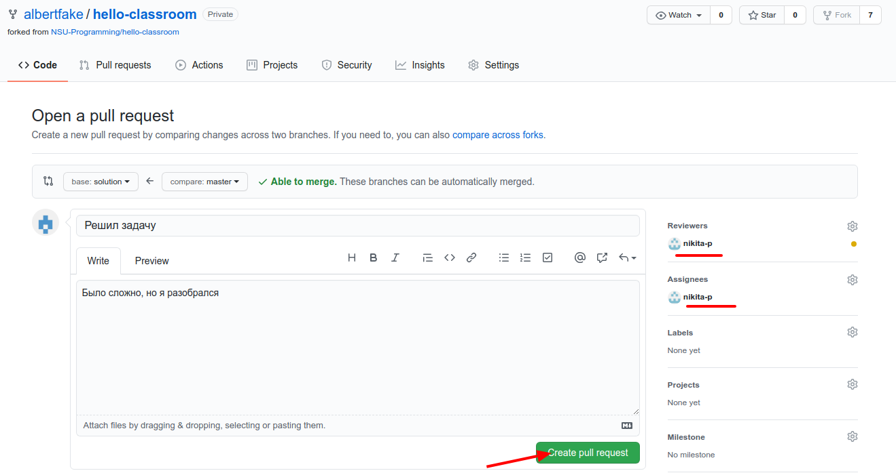
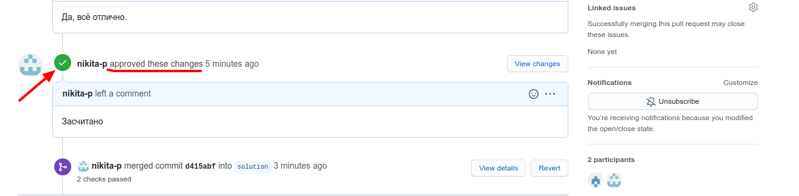

Каждому заданию соответствует репозиторий на [GitHub](https://github.com) в организации [NSU-Programming](https://github.com/NSU-Programming). Первое, что необходимо сделать до начала работы над заданиями — [зарегистрироваться на GitHub](https://github.com/join).

После регистрации необходимо сообщить свой логин на GitHub семинаристу или [лектору](mailto:v.vorobev@nsu.ru?subject=NewGitHubAccount), чтобы Вам открыли доступ к репозиториям.

Чтобы начать решать задачу необходимо сделать [fork](https://docs.github.com/en/github/getting-started-with-github/fork-a-repo) репозитория в свой аккаунт, кликнув на кнопку `Fork`, показанную стрелкой на скриншоте снизу.
 
 
В созданном форке нужно перейти на вкладку `Actions` и включить `Workflows` - это включит автоматическую проверку вашего решения тестами на Github

Теперь можно приступать к решению. 
В файле README.md содержится описание условия задачи и инструкции по локальному тестированию решения. В процессе решения задания Вы можете несколько раз обновлять код в Вашей версии репозитория на GitHub (команда `git push`). Каждый раз при этом будут запускаться тесты, аналогичные локальным тестам.

Пройдены тесты или нет можно посмотреть на странице репозитория. ✓ - тесты пройдены, ❌ - не пройдены.

В данном случае тесты пройдены успешно, можно сдавать задание.
(Если тесты никак не удаётся пройти, но вы уверены в своём решении, то возможно проблема в тестах)

Когда Вы готовы сдать задание, необходимо создать pull request (PR) в ветку `solution` вашего форка.
Для этого нажмите кнопку `New pull request` во вкладке `Pull Requests`

Далее выберете свой репозиторий из списка `Choose a Base Repository`

и затем ветку `solution`

Проверьте ещё раз ветку, в который вы отправляете ПР и нажимайте кнопку

Теперь выберете своего преподавателя из списка, для того чтоб он проверил вашу задачу

и окончательно подтвердите ПР

Всё. Теперь ждите ответа преподавателя в комментариях к этому ПР.
Чаще всего перед тем как засчитать задание, семинарист в комментариях к PR будет просить улучшить некоторые аспекты Вашего кода. В этом случае необходимо внести необходимые изменения и отправить их в ту ветку, к которой привязан PR.
Если всё хорошо, то семинарист одобрит ваш ПР и зачтёт задачу как на скриншоте ниже

Удачи.

основной репозиторий задания. PR должен указывать на отдельную ветку, которая должна иметь название, совпадающее с Вашим логином на GitHub. Задание принято в тот момент, когда семинарист выполнит команду merge для Вашего PR. 

Рассмотрим все этапы решения задания на примере.
