Для работы над заданиями курса в Windows 10 рекомендуется использовать следующее программное окружение:

* Редактор [Visual Studio Code](https://code.visualstudio.com/)
* Инструменты командной строки [Git for Windows](https://git-scm.com/download/win)
* Среда разработки [MinGW-w64](https://en.wikipedia.org/wiki/Mingw-w64) (Minimalist GNU for Windows), содержащая компилятор [GCC](https://en.wikipedia.org/wiki/GNU_Compiler_Collection) (GNU Compiler Collection)
* Инструменты для сборки проектов [CMake](https://cmake.org/)
* Система управления пакетами python [Miniconda3](https://docs.conda.io/en/latest/miniconda.html)

Рассмотрим процесс установки и настройки этих инструментов.

## Установка VS Code

Установка VS Code не представляет сложностей. Достаточно скачать установочный файл со [страницы загрузок](https://code.visualstudio.com/Download) и запустить его. Пока это все что необходимо сделать. После установки остальных программ мы вернемся к настройке VS Code.

## Установка и настройка Git for Windows

Cкачайте установочный файл Git for Windows со [страницы загрузок](https://git-scm.com/downloads) и запустите его. На момент написания этого текста актуальной версией является 2.28.0. В процессе установки Вам будут заданы вопросы по конфигурации. В большинстве случаев подойдут рекомендуемые варианты.

Если в системе уже установлен редактор VS Code, то его можно выбрать в качестве редактора по умолчанию для Git:

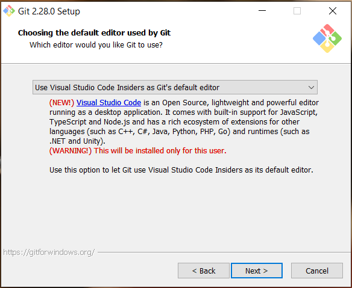

Важным моментом является настройка обработки конца строки в файлах. Чтобы с этим не возникало проблем, необходимо выбрать вариант, который уже отмечен по умолчанию:

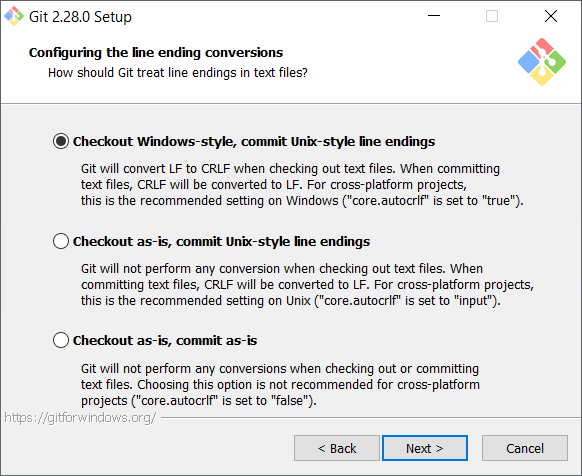

Чтобы команды git были доступны во всех терминалах, следует выбрать рекомендуемый вариант для изменения переменной окружения PATH:

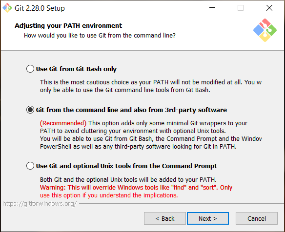

Проверьте, что установка завершилась успешно, открыв терминал и исполнив команду `git`. Результат должен выглядеть так:

```sh
> git
usage: git [--version] [--help] [-C <path>] [-c <name>=<value>]
           [--exec-path[=<path>]] [--html-path] [--man-path]
           [--info-path] [-p | --paginate | -P | --no-pager]
           [--no-replace-objects] [--bare] [--git-dir=<path>]
           [--work-tree=<path>] [--namespace=<name>]
           <command> [<args>]
```

В качестве терминала в Windows 10 мы рекомендуем использовать [PowerShell](https://ru.wikipedia.org/wiki/PowerShell).

Теперь необходимо задать имя пользователя и адрес электронной почты:

```sh
> git config --global user.name "Ivan Petrov"
> git config --global user.email i.petrov@nsu.ru
```

Git хранит настройки в файле `~\.gitconfig`. У автора этот файл выглядит следующим образом:

```sh
[user]
    email = vit.vorobiev@gmail.com
    name = Vitaly Vorobyev
[core]
    editor = \"[path-to-vscode]" --wait

```

На этом первоначальная конфигурация инструментов git завершена. Навык работы с git приходит с практикой. Действия с git, необходимые для выполнения заданий курса, всегда будут подробно описаны. Тем не менее, мы рекомендуем обращаться к [документации](https://git-scm.com/book/ru/v2), чтобы прояснять непонятные моменты.

## Установка MinGW-w64

Установочный файл MinGW-w64 `mingw-w64-install.exe` можно найти на [этой странице](https://sourceforge.net/projects/mingw-w64/files/Toolchains%20targetting%20Win32/Personal%20Builds/mingw-builds/installer/). При установке не нужно менять настрйки по умолчанию, кроме пути установки. **Путь установки не должен содержать пробелов**, поэтому путь по умолчанию в директории `Program Files` не подходит.

После заверщения установки, в директории `mingw32\bin` будут расположены различные исполняемые файлы. Среди них нас интересует файл `g++.exe`, который запускает сборку программ C++. Сделаем так, чтобы этот файл был доступен в любой директории из командной строки. Если этого не сделать, то для использования команды `g++` надо будет прописывать полный путь до файла `g++.exe`.

Откройте меню "Система" в "Панели управления":

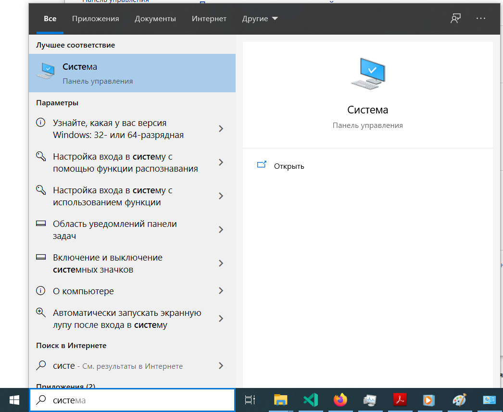

Из меню "Система" перейдите в "Дополнительные параметры системы":

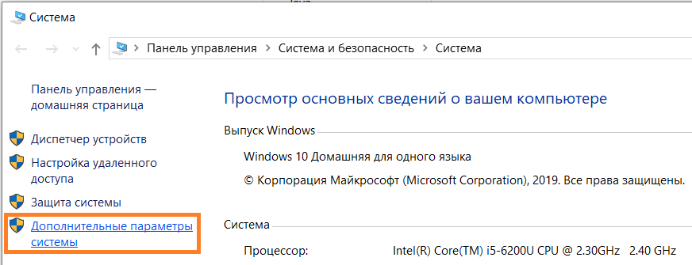

Выберите "Переменные среды":

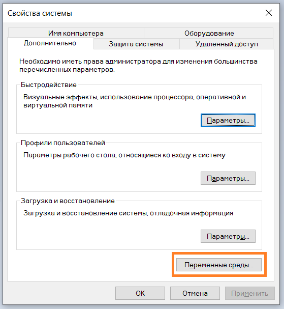

Выберите переменную `Path` и нажмите кнопку "Изменить...":

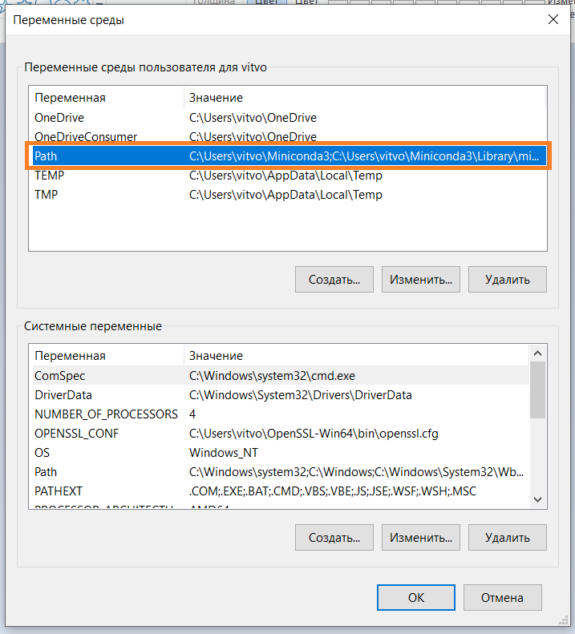

Добавьте в новую строку полный путь до директории `mingw32\bin` и нажмите кнопку OK.

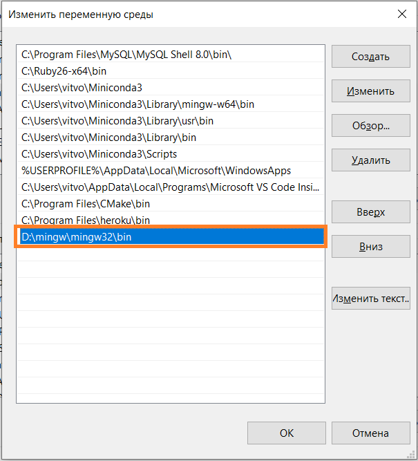

Чтобы проверить, что настройка выполнена успешно, откройте консоль (не в директории `mingw32\bin`) и выполните команду `g++ --help`:

```sh
> g++ --help
Usage: g++.exe [options] file...
```

Ваша система теперь готова к сборке программ на языке C++.

## Установка CMake

Скачайте со [станицы загрузок](https://cmake.org/download/) установочный файл `cmake-3.18.1-win64-x64.msi` (на момент написания текста актуальная версия - 3.18.1). Для 32-разрядной системы вместо этого нужно скачать файл `cmake-3.18.1-win32-x86.msi`. Запустите файл и выполните установку. В ходе установки выберите изменение переменной окружения PATH:

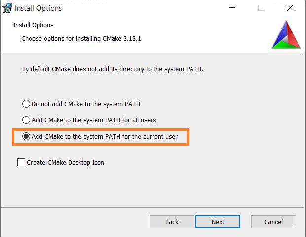

Выполните в консоли команду `cmake --help` для проверки корректности установки CMake:

```sh
> cmake --help
Usage

  cmake [options] <path-to-source>
  cmake [options] <path-to-existing-build>
  cmake [options] -S <path-to-source> -B <path-to-build>

Specify a source directory to (re-)generate a build system for it in 
the current working directory.  Specify an existing build directory to
re-generate its build system.
```

Код большинства заданий по C++ этого курса будет компилироваться с помощью CMake. Эта система значительно упрощает процесс сборки C++ проектов, особенно если они состояит из многих файлов.

## Установка Miniconda3

Система Windows (в отличие от Linux) не имеет установенного по умолчанию интерпретатора python. Менеджер пакетов python Anaconda и его минимальная сборка Miniconda позволят нам установить в системы все необходимые инструменты для работы с python. Загрузите со [страницы загрузки](https://docs.conda.io/en/latest/miniconda.html) установочный файл `Miniconda3 Windows 64-bit` или `Miniconda3 Windows 32-bit`, в зависимости от разрядности системы. При установке отметьте галочку для добавления необходимых записей в переменную окружения PATH, несмотря на то что это действите не рекомендуется установщиком:

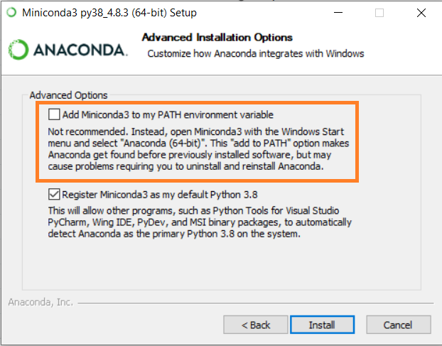

Убедитесь в том, что установка выполнена успешно, выполнив в консоли следующую команду:

```sh
>conda --help
usage: conda-script.py [-h] [-V] command ...

conda is a tool for managing and deploying applications, environments and packages.
```

Выполните инициализацию (необходимо выполнить один раз):

```sh
>conda init
```

Создайте окружение для работы с заданями этого курса:

```sh
>conda create -n nsu python=3
```

Conda вычислит набор пакетов, которые необходимо установить в новом окружении, и попросит подтвердить создание окружения:

```sh
Proceed ([y]/n)? y
```

После установки активируйте новое окружение и запустите консоль python:

```sh
>conda activate nsu
(nsu) >python
Python 3.8.5 (default, Aug  5 2020, 09:44:06) [MSC v.1916 64 bit (AMD64)] :: Anaconda, Inc. on win32
Type "help", "copyright", "credits" or "license" for more information.
>>>
```

Ваша система теперь готова для работы с заданиями курса "Программирование на C++ и python". Нам осталось настроить редактор VS Code для максимально удобной работы.

## Настройка VS Code

Установите следующие расширения VS Code:

* [C/C++ for Visual Studio Code](https://code.visualstudio.com/docs/languages/cpp)
* [CMake Tools](https://marketplace.visualstudio.com/items?itemName=ms-vscode.cmake-tools)
* [Python](https://marketplace.visualstudio.com/items?itemName=ms-python.python)

### Выбор интерпретатора python

При начале работы с кодом python (при открытии файла с расширением `.py`) VS Code предложит выбрать интерпретатор python, который будет использоваться для подсветки кода, проверки синтаксиса и вывода подсказок:

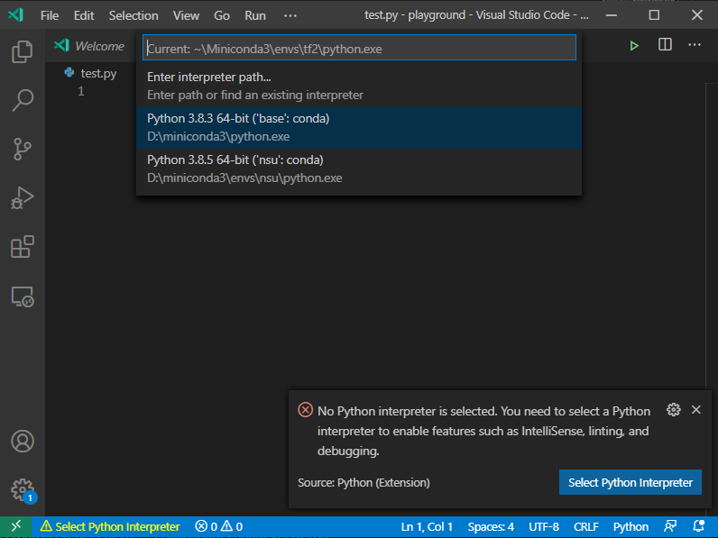

Можете, например, выбрать интерпретатор из недавно созданного окружения nsu.

Создадим файл `test.py`, содержащий одну строку:

```py
print('Hello, world!')
```

Исполнить этот скрипт можно, открыв консоль в VS Code с помощью сочетания клавиш `Ctrl+j` и набрав в ней

```sh
python test.py
```

В правом верхнем углу окна находится кнопка с зеленым треугольником &#9655;, нажатие на которую приводит к тому же результату:

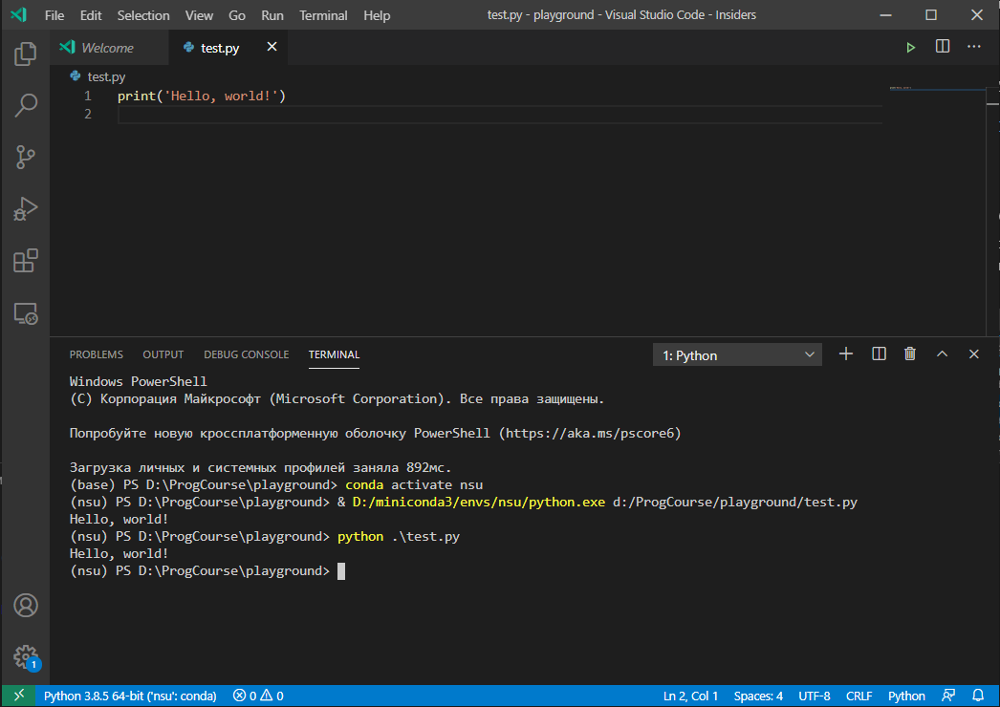

### Настройка работы с GCC

Создайте файл `test.cpp`, содержащий следующий код:

```cpp
#include <iostream>

int main() {
    std::cout << "Hello, world!" << std::endl;
    return 0;
}
```

Скомпилируем его с помощью компилятора GCC и командной строки. Откройте консоль в VS Code (`Ctrl+j`) и исполнтие команду

```sh
> g++ test.cpp
```

Компилятор создал исполняемый файл `a.exe`. Запустите его:

```sh
> .\a.exe
Hello, world!
```

Работает. Настроим теперь VS Code для автоматизации этого действия. Выберите в меню пункт `Terminal -> Configure Degault Build Task...`:

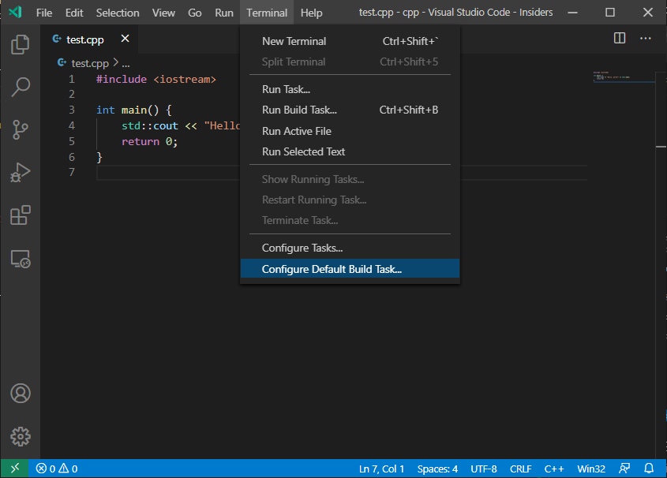

Выбирите из выпавшего списка пункт `g++.exe`. В результате будет сгенерирован файл `.vscode/tasks.json` подобный такому:

```json
{
    "version": "2.0.0",
    "tasks": [
        {
            "type": "shell",
            "label": "C/C++: cpp.exe build active file",
            "command": "D:\\mingw\\mingw32\\bin\\g++.exe",
            "args": [
                "-g",
                "${file}",
                "-o",
                "${fileDirname}\\${fileBasenameNoExtension}.exe"
            ],
            "options": {
                "cwd": "${workspaceFolder}"
            },
            "problemMatcher": [
                "$gcc"
            ],
            "group": {
                "kind": "build",
                "isDefault": true
            }
        }
    ]
}
```

Теперь при нажатии клавиш `Ctrl+Shift+B` или выборе пункта меню `Terminal -> Run Build Task` будет выполняться компиляция открытого файла. Для файла `test.cpp` будет создан исполняемый файл `test.exe`.

### Работа с CMake

Откройте новую рабочую директорию VS Code, создайте в ней файл `main.cpp`, содержаший следующий код:

```cpp
#include <iostream>

int main() {
    std::cout << "Hello, world!" << std::endl;
    return 0;
}
```

и файл `CMakeLists.txt` со следующим содержанием:

```cmake
cmake_minimum_required(VERSION 3.0.0)
add_executable(test main.cpp)
```

Эти два файла составляют минимальный CMake-проект. Выполним сначала сборку CMake-проекта через консоль: создайте в рабочей директории поддиректорию `build`, в которой будет осуществляться сборка, и перейдите в неё:

```sh
> mkdir build; cd build
```

Выполните настройку проекта и запустите сборку:

```sh
> cmake -G "MinGW Makefiles" ..
> cmake --build .
```

В первой команде мы указали, что сборка будет осуществляться с помощью MinGW и что файлы проекта расположены в родительской директории (путь `..`). Вторая команда осуществляет сборку в текущей директории (путь `.`). В директории `build` должен появиться исполняемый файл `test.exe`.

Расширение VS Code для работы с CMake позволяет автоматизировать сборку проекта. Выберите рабочую директорию VS Code (комбинация клавиш `Ctlr+k+o`), содержащую файлы `main.cpp` и `CMakeLists,txt`. Наберите комбинацию клавиш `Ctrl+Shift+P` и в строке сверху наберите команду `>CMake: Configure`. Это запустит настройку инструментов CMake. После завершения настройки в нижней части окна появятся инструменты управления сборкой:


Кнопку "Сборка" запускает сборку, а кнопка &#9655; - исполняемый файл.

Если автоматическая настройка CMake привела к ошибке, то, вероятно, инициализация CMake выполнилась без параметра `-G "MinGW Makefiles"`. В этом случае выполните эту команду в консоли, как показано выше. Достаточно выполнить это действие один раз, после чего конфигурация этого и других проектов будет выполняться верно.

### Работа с git

Покажем как можно работать с git-репозиторием через VS Code. Выполните fork репозитория задания `Hello, Classroom` на GitHub:

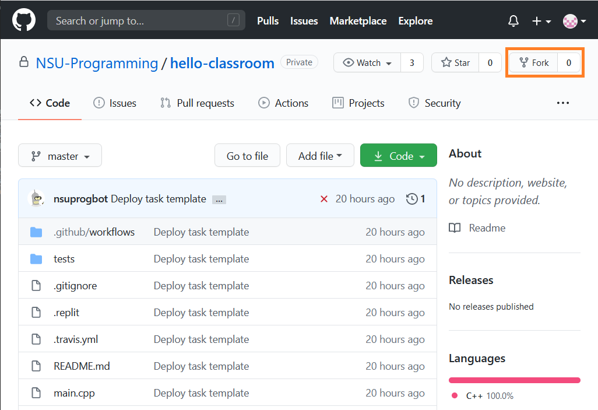

Это действие создает новый репозиторий в Вашем аккаунте. Разрешите автоматическое тестирование решения, нажав на большую зеленую кнопку во вкладке Actions:

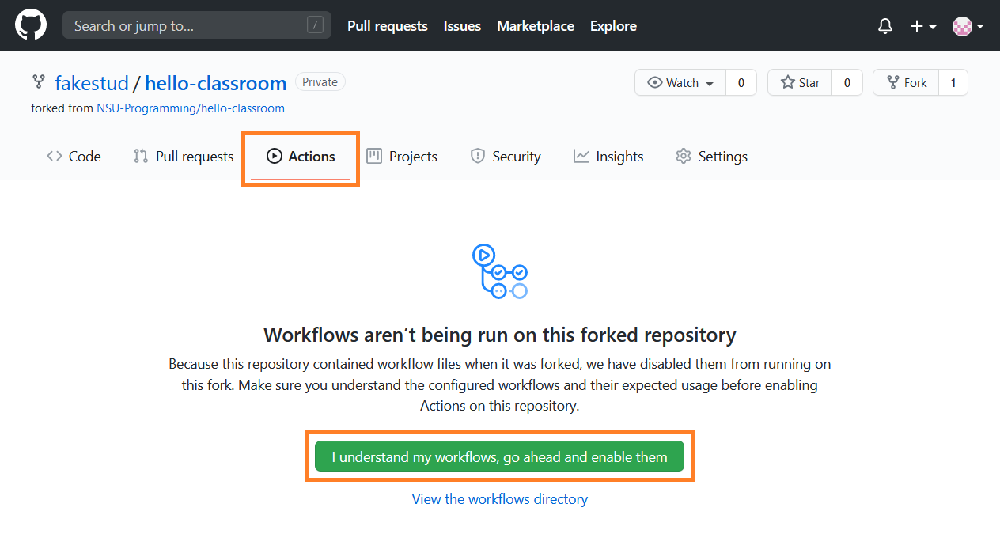

Новый репозиторий необходимо клонировать на Вашу локальную систему. Удобнее всего это делать с помощью [протокола ssh](https://ru.wikipedia.org/wiki/SSH). Для этого сначала необходимо [включить OpenSSL Client](http://www.spy-soft.net/windows-10-openssh-client/), который по умолчанию выключен.

Взаимодействие с GitHub репозиторием будет происходить по протоколу ssh с помощью [техники шифорвания с открытым ключом](https://en.wikipedia.org/wiki/Public-key_cryptography). Создать пару из приватного и публичного ключа можно в консоли:

```sh
>ssh-keygen
Generating public/private rsa key pair.
```

По умолчанию сгенерированные ключи будут расположены в директории `~\.ssh`. Файл с публичным ключом называется `id-rsa.pub`. Публичный ключ нужно добавить на GitHub. Для этого откройте раздел `SSH and GPG keys` в меню `Settings` и нажмите на кнопку `New SSH key`:

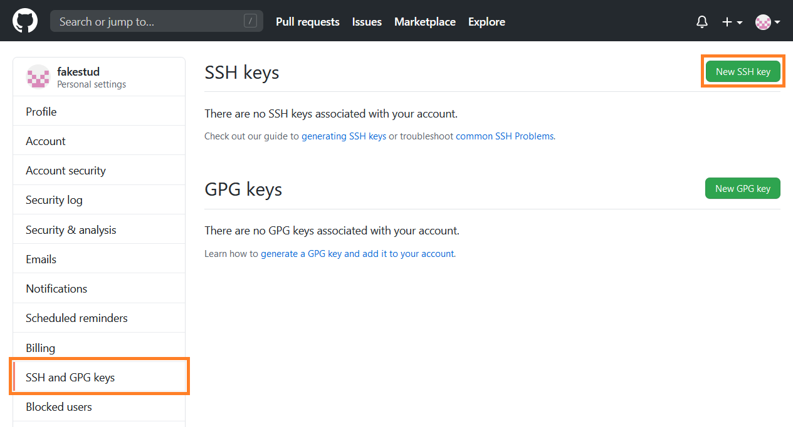

Заполните открывшуюся форму. В поле `Key` нужно скопировать содержимое файла `id-rsa.pub`. Проследите, чтобы при копировании не появились лишние переносы строк. Весь ключ должен быть расположен в одной строке.

Теперь мы готовы к клонированию репозитория. Выберите на компьютере директорию, в которой Вы будете работать с заданиями курса и перейдите в неё. Откройте страницу репозитория `hello-classroom` в Вашем аккаунте GitHub и скопируйте строку для клонирования через ssh:

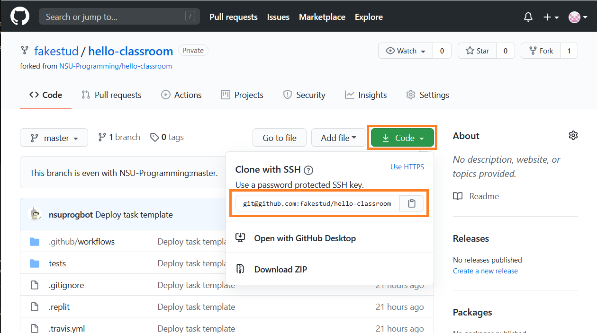

Выполните в консоли команду `git clone`:

```sh
> git clone git@github.com:fakestud/hello-classroom.git
Cloning into 'hello-classroom'...
remote: Enumerating objects: 15, done.
remote: Counting objects: 100% (15/15), done.
remote: Compressing objects: 100% (8/8), done.
remote: Total 15 (delta 0), reused 15 (delta 0), pack-reused 0
Receiving objects: 100% (15/15), done
```

Строка `git@github.com:fakestud/hello-classroom.git` есть скопированная выше строка. Репозиторий был клонирован в директорию `hello-classroom`. Выберите её в качестве рабочей директории VS Code. Прочитайте файл `README.md`, содержащий инструкции по решению задания. После решения задания выполните локальную проверку:

```sh
> conda activate nsu
> pip install -r .\requirements.txt
> g++ -std=c++17 main.cpp -o a.out
> test_cmd tests/ .\a.out
Running 1 tests on 4 CPUs...

test1
Command: .\a.out
Success

All 1 tests passed.
```

Тесты пройдены успешны. Значит, мы готовы к синхронизации репозитория GitHub с нашей локальной версией. В командной строке для этого достаточно выполнить следующие команды:

```sh
git add main.cpp
git commit -m "Task solved"
git push -u origin master
```

Редактор VS Code позволяет выполнить эти действия через графический интерфейс. VS Code отслеживает изменения локальной версии репозитория. Откройте вкладку контроля версий слева и посмотрите на список изменившихся файлов. В нашем случае это должен быть только файл `main.cpp`. Выполните команду `git add`, нажав на кнопку +:

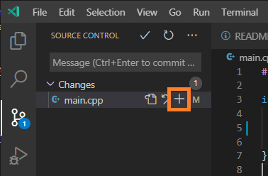

Затем команду `git commit`, нажав на кнопку &#10003; и введя комментарий в текстовом поле:

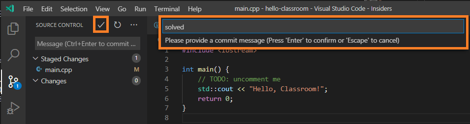

Наконец, выполните команду `git push`:

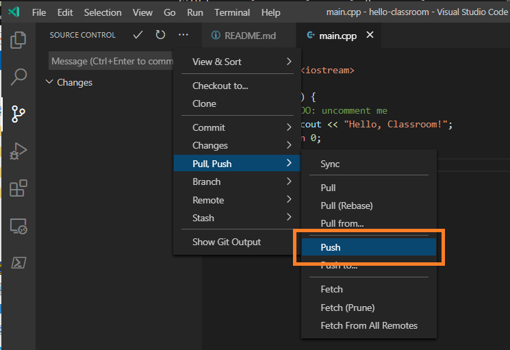

Если Вы считаете, что задание решено верно и Вы готовы его сдать, создайте pull request (PR) на GitHub:

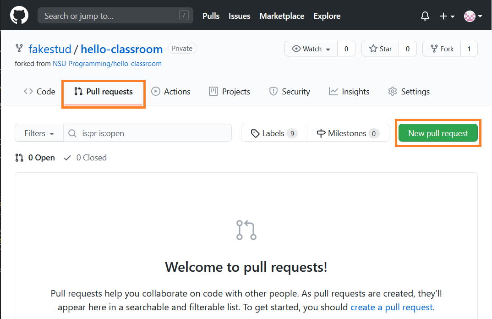
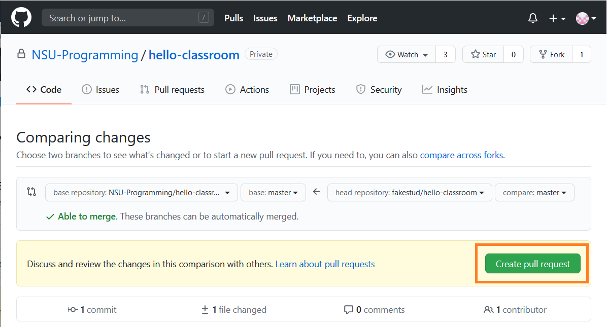

Преподаватель может задавать вопросы и просить выполнить измерения в коде в обсуждении PR на GitHub. Вы можете отвечать на комментарии там же. Чтобы внести изменения в код, необходимо выполнить изменения локально, а затем повторить последовательность `add`, `commit`, `push`. Внесенные изменения будут отражены в PR.

Задание засчитывается в тот момент, когда преподаватель выполняет команду merge для Вашего PR.

## Источники

* [First-Time Git Setup](https://git-scm.com/book/en/v2/Getting-Started-First-Time-Git-Setup)
* [VS Code: User and Workspace Settings](https://code.visualstudio.com/docs/getstarted/settings)
* [VS Code: Using GCC with MinGW](https://code.visualstudio.com/docs/cpp/config-mingw)
* [VS Code: Get started with CMake Tools on Linux](https://code.visualstudio.com/docs/cpp/cmake-linux)
* [Git in Visual Studio Code](https://git-scm.com/book/en/v2/Appendix-A%3A-Git-in-Other-Environments-Git-in-Visual-Studio-Code)
* [Must-have плагины и несколько полезностей для С\С++ разработки в VS Code](https://habr.com/ru/company/aktiv-company/blog/440142/)
* [Памятка пользователям ssh](https://habr.com/ru/post/122445/)
  