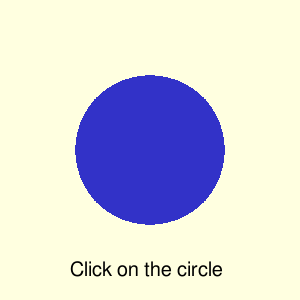
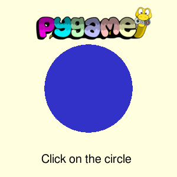

Библиотека pygame создана для разработки игр. Она проста в освоении и позволяет быстро создавать прототипы игр. Cредства библиотеки pygame также позволяют создавать интерактивные визуализации и приложения с простым графическим пользовательским интерфейсом. В этом разделе будут рассмотрены основные инструменты библиотеки pygame.

## Основной цикл

Интерактивность программ с pygame обеспечивается благодаря основному циклу. В этом цикле происходит обработка событий, таких как нажатие кнопок клавиатуры, и отрисовка изображений. Вот так выглядит программа, которая рисует круг и завершается при нажатии Escape или кнопки закрытия окна:

```py
import sys
import pygame

# Инициализация pygame
pygame.init()
# Размер окна
screen = pygame.display.set_mode((300, 300))
# Заголовок окна
pygame.display.set_caption('Blue Circle')

while True:
    # Задаем цвет фона
    screen.fill((255, 255, 224))
    # Рисуем круг
    pygame.draw.circle(screen, (50, 50, 200), (150, 150), 75)
    # Обновляем экран
    pygame.display.flip()

    for event in pygame.event.get():
        if event.type == pygame.QUIT:
            pygame.quit()
            sys.exit()
        elif event.type == pygame.KEYDOWN:
            if event.key == pygame.K_ESCAPE:
                pygame.quit()
                sys.exit()
```

Функция [`pygame.draw.circle`](https://www.pygame.org/docs/ref/draw.html#pygame.draw.circle) принимает следующие аргументы:

* `surface` - объект типа [`Surface`](https://www.pygame.org/docs/ref/surface.html) - поверхность, на которой будет отрисован круг. В данном случае это основное окно программы.
* `color` - кортеж из трех целых чисел или объект типа [`Color`](https://www.pygame.org/docs/ref/color.html) - цвет фигуры в представлении RGB.
* `center` - кортеж из двух челых чисел - координаты центра круга в пикселях. Координаты отсчитываются от левого верхнего угла.
* `radius` - радиус круга в пикселях.
* `width` - ширина кольца в пикселях - необязательный параметр. Если параметр задан, то будет нарисовано кольцо, а не круг.

Функция `pygame.draw.circle` возвращает объект [`Rect`](https://www.pygame.org/docs/ref/rect.html) - прямоугольник, содержащий нарисованный объект. Это нам еще пригодиться, когда мы будем организовывать взаимодействие с кругом.


## Вывод текста

За работу с текстом в pygame отвечает модуль [font](https://www.pygame.org/docs/ref/font.html). Перед его использованием необходимо выполнить инициализацию

```py
pygame.font.init()
```

Функция [`pygame.font.SysFont`](https://www.pygame.org/docs/ref/font.html#pygame.font.SysFont) создает объект типа [`Font`](https://www.pygame.org/docs/ref/font.html#pygame.font.Font), который может отрисовывать текст:

```py
font = pygame.font.SysFont(name=font, size=20)
surf = font.render(
    'Click on the circle',
    antialias=True,
    color=(0, 0, 0))
screen.blit(surf, (70, 260))
```

Функция `render` создает объект типа `Surface` с отрисованным текстом. Параметр `antialias` управляет сглаживанием текста.

Метод [`Surface.blit`](https://www.pygame.org/docs/ref/surface.html#pygame.Surface.blit) отрисовывает одну поверхность на другой. Мы ей воспользовались чтобы отрисовать поверхность с текстом в основном окне. В результате получаем следующее:



## Обработка событий

Следаем так, чтобы круг менял цвет при нажатии на него мышкой:

```py
def get_color():
    idx = 0
    colors = [
        (50, 50, 200),
        (50, 200, 50),
        (200, 50, 50)
    ]
    while True:
        yield colors[idx % len(colors)]
        idx += 1

colors = get_color()
color = next(colors)

while True:
    # ...
    circ_rect = pygame.draw.circle(screen, color, (150, 150), 75)

    for event in pygame.event.get():
        # ...
        if event.type == pygame.MOUSEBUTTONDOWN:
            if circ_rect.collidepoint(event.pos):
                color = next(colors)
```

Атрибут `pos` возвращает координаты нажатия курсора, метод [`Rect.collidepoint`](https://www.pygame.org/docs/ref/rect.html#pygame.Rect.collidepoint) возвращает `True`, если координаты лежат внутри прямоугольника.

## Графические примитивы и маски

Модуль [`pygame.draw`](https://www.pygame.org/docs/ref/draw.html) содержит инструменты для отрисовки различных графических примитивов:

* `pygame.draw.polygon(surface, color, pointlist, width)`
* `pygame.draw.line(surface, color, start_point, end_point, width)`
* `pygame.draw.lines(surface, color, closed, pointlist, width)`
* `pygame.draw.circle(surface, color, center_point, radius, width)`
* `pygame.draw.ellipse(surface, color, bounding_rectangle, width)`
* `pygame.draw.rect(surface, color, rectangle_tuple, width)`

В текущем виде программа реагирует на нажатие мышки внутри квадрата, описанного вокруг круга. Для проверки попадания координаты внутрь круга можно использовать инструменты модуля `pygame.mask`:

```py
while True:
    # ...
    circ_surf = pygame.Surface((150, 150), pygame.SRCALPHA, 32).convert_alpha()
    circ_rect = pygame.draw.circle(circ_surf, color, (75, 75), 75)
    screen.blit(circ_surf, (75, 75))
    circ_mask = pygame.mask.from_surface(circ_surf)

    for event in pygame.event.get():
        # ...
        if event.type == pygame.MOUSEBUTTONDOWN:
            rpos = (event.pos[0] - 75, event.pos[1] - 75)
            if circ_rect.collidepoint(rpos) and\
                    circ_mask.get_at(rpos):
                color = next(colors)
```

Сначала мы создали прозрачную поверхность, на которой нарисовали круг. Затем на основе этой поверхности создали битовую маску, соответствующую пикселям поверхности. Маска выделяет все непрозрачные пиксели поверхности. При проверке попадания координаты внутрь круга используется метод [`mask.get_at`](https://www.pygame.org/docs/ref/mask.html#pygame.mask.Mask.get_at), возвращающий значение маски в заданной позиции. Поскольку круг нарисован на поверхности `circ_surf`, а не в главной поверхности, то проверка положения выполняется в локальных координатах на поверхности `circ_surf`.

## Работа с растровыми файлами

Модуль `pygame.image` позволяет открывать изображение из файла и сохранять поверхности (объекты типа `Surface`) в файл. Поместим логотип pygame в наше окно:


```py
logo_surf = pygame.image.load('figs/logo_lofi.png')
screen.blit(logo_surf, (60, 10))
```

В результате получаем:



Чтобы сохранить содержимое поверхности в файл нужно вызвать

```py
pygame.image.save(screen, 'screen.png')
```

## Частота обновления

Наш учебный пример не содержит двигающихся объектов, поэтому никакой разницы с какой частотой выполняется основной цикл. Ситуация меняется, если в программе есть анимация. В этом случае скорость движения прямо зависит от скорости работы цикла. Модуль `pygame.time` содержит инструменты для работы со временем. Например, класс `pygame.time.Clock` позволяет ограничить количество обновлений в секунду:

```py
frames_per_second = 30
clock = pygame.time.Clock()

while True:
    # ...
    clock.tick(frames_per_second)
```

Другой вариант - функция [`pygame.time.wait'](https://www.pygame.org/docs/ref/time.html#pygame.time.wait), которая выполняет задержку на определенное количество миллисекунд. Заметим, что использовать задержку имеет смысл даже в нашем примере. Действительно, достаточно малая задержка не будет видна пользователю, но позволит значительно уменьшить нагрузку на процессор. Полный код нашего примера выглядит так:

```py
import sys
import pygame

# Инициализация pygame
pygame.init()
pygame.font.init()
# Размер окна
screen = pygame.display.set_mode((300, 300))
# Заголовок окна
pygame.display.set_caption("Blue Circle")

font = pygame.font.SysFont(name='arial', size=20)

def get_color():
    idx = 0
    colors = [
        (50, 50, 200),
        (50, 200, 50),
        (200, 50, 50)
    ]
    while True:
        yield colors[idx % len(colors)]
        idx += 1

text = 'Click on the circle'
colors = get_color()
color = next(colors)

logo_surf = pygame.image.load('figs/logo_lofi.png')
delay = 100

while True:
    # Задаем цвет фона
    screen.fill((255, 255, 224))
    # Рисуем круг
    circ_surf = pygame.Surface((150, 150), pygame.SRCALPHA, 32).convert_alpha()
    circ_rect = pygame.draw.circle(circ_surf, color, (75, 75), 75)
    screen.blit(circ_surf, (75, 75))
    circ_mask = pygame.mask.from_surface(circ_surf)
    # Рисуем текст
    font_surf = font.render(text, True, (0, 0, 0))
    screen.blit(font_surf, (70, 260))
    # Рисуем лого pygame
    screen.blit(logo_surf, (60, 10))
    # Обновляем экран
    pygame.display.flip()

    for event in pygame.event.get():
        if event.type == pygame.QUIT:
            pygame.quit()
            sys.exit()
        elif event.type == pygame.KEYDOWN:
            if event.key == pygame.K_ESCAPE:
                pygame.quit()
                sys.exit()
        elif event.type == pygame.MOUSEBUTTONDOWN:
            rpos = (event.pos[0] - 75, event.pos[1] - 75)
            if circ_rect.collidepoint(rpos) and\
                    circ_mask.get_at(rpos):
                color = next(colors)

    pygame.time.wait(delay)
```

## Резюме

В этом разделе мы обсудили основные инструмены библиотекаи pygame.

## Источники

* [Документация pygame](https://www.pygame.org/docs/)
* [PyGame: A Primer on Game Programming in Python](https://realpython.com/pygame-a-primer/)
* [Python pygame – The Full Tutorial](https://coderslegacy.com/python/python-pygame-tutorial/)
* [Game loop](https://gameprogrammingpatterns.com/game-loop.html)
* [Game Loop pattern](https://www.patternsgameprog.com/discover-python-and-patterns-8-game-loop-pattern/)
* [dr0id pygame tutorials](https://dr0id.bitbucket.io/legacy/pygame_tutorials.html)
