Библиотека matplotlib содержит большой набор инструментов для двумерной графики. Она проста в использовании и позволяет получать графики публикационного качества. В этом разделе мы рассмотрим наиболее распространенные типы диаграмм и различные настройки их отображения.

Модуль [`matplotlib.pyplot`](https://matplotlib.org/3.1.1/api/_as_gen/matplotlib.pyplot.html) предоставляет процедурный интерфейс к (объектно-ориентированной) библиотеке matplotlib, который во многом копирует инструменты пакета [MATLAB](https://www.mathworks.com/products/matlab.html). Инструменты модуля `pyplot` де-факто являются стандартным способом работы с библиотекой `matplotlib`, поэтому мы органичимся рассмотрением этого пакета.

## Двумерные графики

### pyplot.plot

Нарисовать графики функций sin и cos с matplotlib.pyplot можно слудующим образом:

```py
import numpy as np
import matplotlib.pyplot as plt

phi = np.linspace(0, 2.*np.pi, 100)
plt.plot(phi, np.sin(phi))
plt.plot(phi, np.cos(phi))

plt.show()
```

В результате получаем


Мы использовали функцию [plot](https://matplotlib.org/api/_as_gen/matplotlib.pyplot.plot.html), которой передали два параметра - списки значений по горизонтальной и вертикальной осям. При последовательных вызовах функции plot графики строятся в одних осях, при этом происходит автоматическое переключение цвета.

Строковый параметр

```py
fmt = '[marker][line][color]'
```

функции plot позволяет задавать тип маркера, тип линии и цвет. Приведем несколько примеров:

```py
x = np.linspace(0, 1, 100)
f1 = 0.25 - (x - 0.5)**2
f2 = x**3
plt.plot(x, f1, ':b')    # пунктирная синяя линия
plt.plot(x, f2, '--r')   # штрихованная красная линия
plt.plot(x, f1+f2, 'k')  # черная непрерывная линия

plt.show()
```

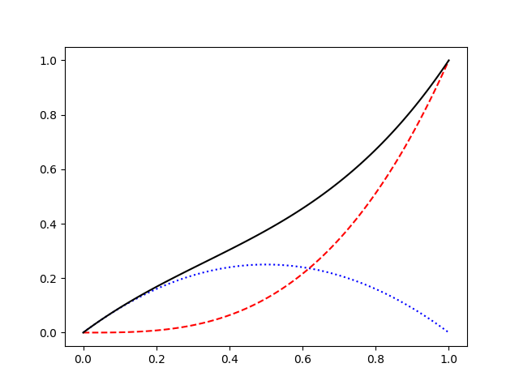

```py
rg = np.random.Generator(np.random.PCG64())
plt.plot(rg.binomial(10, 0.3, 6), 'ob')  # синие круги
plt.plot(rg.poisson(7, 6), 'vr')         # красные треугольники
plt.plot(rg.integers(0, 10, 6), 'Dk')    # черные ромбы

plt.show()
```

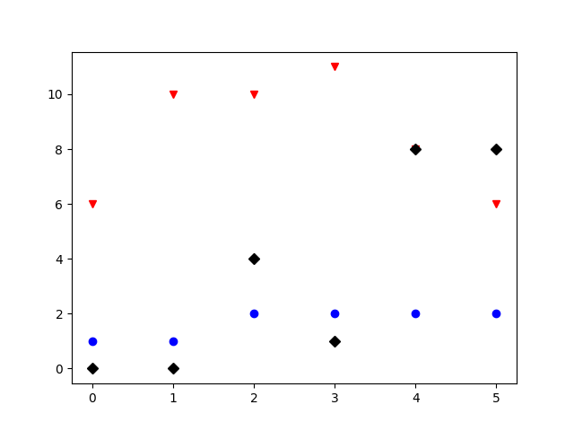

Из последнего примера видно, что если в функцию plot передать только один список `y`, то он будет использован для значений по вертикальной оси. В качестве значений по горизонтальной оси будет использован `range(len(y))`.

Более тонкую настройку параметров можно выполнить, передавая различные именовенные аргументы, например:

* marker - типа маркера
* merkersize - размер маркера
* linestyle - тип линии
* linewidth - толщина линии
* color - цвет

Полный список доступных параметров можно найти [в документации](https://matplotlib.org/api/_as_gen/matplotlib.lines.Line2D.html#matplotlib.lines.Line2D).

### pyplot.errorbar

Результаты измерений в физике чаще всего представлены в виде величин с ошибками. Функция [`plt.errorbar`](https://matplotlib.org/api/_as_gen/matplotlib.pyplot.errorbar.html#matplotlib.pyplot.errorbar) позволяет отображать такие данные:

```py
rg = np.random.Generator(np.random.PCG64(5))
x = np.arange(6)
y = rg.poisson(149, x.size)
plt.errorbar(x, y, yerr=np.sqrt(y), marker='o', linestyle='none')
plt.show()
```

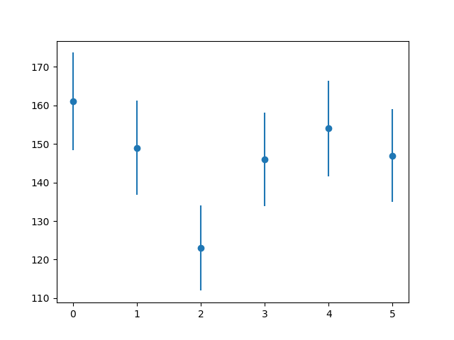

Ошибки можно задавать и для значений по горизонтальной оси:

```py
rg = np.random.Generator(np.random.PCG64(5))
N = 6
x = rg.poisson(169, N)
y = rg.poisson(149, N)
plt.errorbar(x, y, xerr=np.sqrt(x), yerr=np.sqrt(y), marker='o', linestyle='none')
plt.show()
```

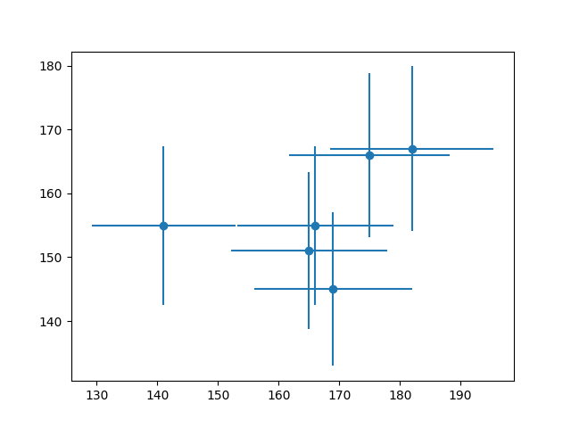

Ошибки измерений могут быть асимметричными. Для их отображения в качестве параметра `yerr` (или `xerr`) необходимо передать кортеж из двух списков:

```py
rg = np.random.Generator(np.random.PCG64(11))
N = 6
x = np.arange(N)
y = rg.poisson(149, N)
yerr = [
    0.7*np.sqrt(y),
    1.2*np.sqrt(y)
]
plt.errorbar(x, y, yerr=yerr, marker='o', linestyle='none')
plt.show()
```

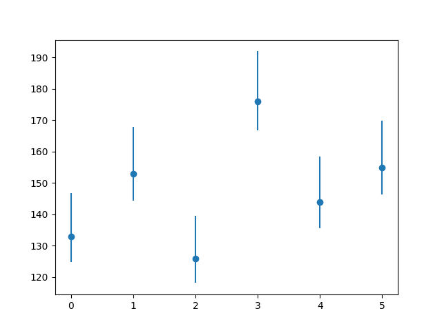

Функция `pyplot.errorbar` поддерживает настройку отображения графика с помощью параметра `fmt` и всех именованных параметров, которые доступны в функции `pyplot`. Кроме того, здесь появляются параметры для настройки отображения линий ошибок ("усов"):

* ecolor - цвет линий ошибок
* elinewidth - ширина линий ошибок
* capsize - длина "колпачков" на концах линий ошибок
* capthick - толщина "колпачков" на концах линий ошибок

и некоторые другие. Изменим параметры отрисовки данных из предыдущего примера:

```py
# ...
plt.errorbar(x, y, yerr=yerr, marker='o', linestyle='none',
    ecolor='k', elinewidth=0.8, capsize=4, capthick=1)
plt.show()
```

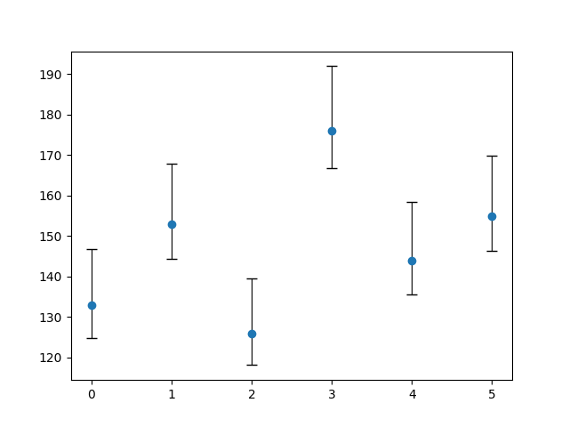

## Настройки отображения

Наши графики все еще выглядят довольно наивно. В этой части мы рассмотрим различные настройки, которые позволят достичь качества диаграмм публикационного уровня.

### Диапазон значений осей

Задавать диапазон значений осей в matplotlib можно несколькими способами. Например, так:

```py
pyplot.xlim([0, 200])  # диапазон горизонтальной оси от 0 до 200
pyplot.xlim([0, 1])    # диапазон вертикальной оси от 0 до 1
```

### Размер шрифта

Размер и другие свойста шрифта, который используется в matplotlib по умолчанию, можно изменить с помощью объекта `matplotlib.rcParams`:

```py
matplotlib.rcParams.update({'font.size': 14})
```

Объект `matplotlib.rcParams` хранит множество настроек, изменяя которые, можно управлять поведением по умолчанию. Смотрите подробнее в [документации](https://matplotlib.org/tutorials/introductory/customizing.html).

### Подписи осей

Подписи к осям задаются следующим образом:

```py
plt.xlabel('run number', fontsize=16)
plt.ylabel(r'average current ($\mu A$)', fontsize=16)
```

В подписях к осям (и вообще в любом тексте в matplotlib) можно использовать инструменты текстовой разметки [TeX](https://en.wikipedia.org/wiki/TeX), позволяющие отрисовывать различные математические выражения. TeX-выражения должны быть внутри пары символов `$`, кроме того, их следует помещать в r-строки, чтобы избежать неправильной обработки.

### Заголовок

Функция `pyplot.title` задает заголовок диаграммы. Применим наши новые знания:

```py
import numpy as np
import matplotlib.pyplot as plt
import matplotlib

# задаем размер шрифта
matplotlib.rcParams.update({'font.size': 12})

rg = np.random.Generator(np.random.PCG64(11))
x = np.arange(6)
y = rg.poisson(149, x.size)
yerr = [
    0.7*np.sqrt(y),
    1.2*np.sqrt(y)
]
plt.errorbar(x, y, yerr=yerr, marker='o', linestyle='none',
    ecolor='k', elinewidth=0.8, capsize=4, capthick=1)

# добавляем подписи к осям и заголовок диаграммы
plt.xlabel('run number', fontsize=16)
plt.ylabel(r'average current ($\mu A$)', fontsize=16)
plt.title(r'The $\alpha^\prime$ experiment. Season 2020-2021')

# задаем диапазон значений оси y
plt.ylim([0, 200])
# оптимизируем поля и расположение объектов
plt.tight_layout()

plt.show()
```

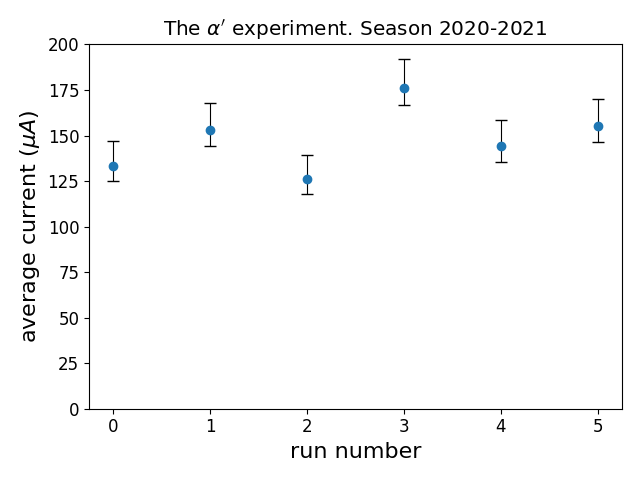

В этом примере мы использовали функцию [pyplot.tight_layout](https://matplotlib.org/tutorials/intermediate/tight_layout_guide.html), которая автоматически подбирает параметры отображения так, чтобы различные элементы не пересекались.

### Легенда

При построении нескольких графиков в одних осях поезно добавлять легенду - пояснения к каждой линии. Следующий пример показывает как это делается с помощью аргументов `label` и функции [`pyplot.legend`](https://matplotlib.org/3.1.1/api/_as_gen/matplotlib.pyplot.legend.html):

```py
import numpy as np
import matplotlib.pyplot as plt
import matplotlib

matplotlib.rcParams.update({'font.size': 12})

x = np.linspace(0, 1, 100)
f1 = 0.25 - (x - 0.5)**2
f2 = x**3

# указываем в аргументе label содержание легенты 
plt.plot(x, f1, ':b', label='1st component')
plt.plot(x, f2, '--r', label='2nd component')
plt.plot(x, f1+f2, 'k', label='total')

plt.xlabel(r'$x$', fontsize=16)
plt.ylabel(r'$f(x)$', fontsize=16)

plt.xlim([0, 1])
plt.ylim([0, 1])

# выводим легенду
plt.legend(fontsize=14)

plt.tight_layout()

plt.savefig(f'plots/mpl{exno}.png')

plt.show()
```

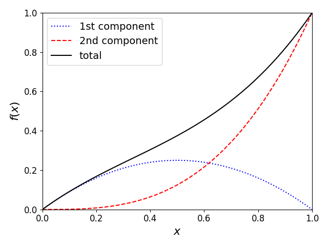

Функция `pyplot.legend` старается расположить легенду так, чтобы она не пересекала графики. Аргумент `loc` позволяет задать расположение легенды вручную. В большинстве случаев расположение по умолчанию получается удачным. Детали и описание других аргументов смотрите в [документации](https://matplotlib.org/3.1.1/api/_as_gen/matplotlib.pyplot.legend.html).

### Сетка

Сетка во многих случаях облегчает анализ графиков. Включить отображение сетки можно с помощью функции `pyplot.grid`. Аргумент `axis` этой функции имеет три возможных значения: `x`, `y` и `both` и определяет оси, вдоль которых будут проведены линии сетки. Управлять свойствами линии сетки можно с помощью именованых аргументов, которые мы рассматривали выше при обсуждении функции `pyplot.plot`.

В matplotlib поддердивается два типа сеток: основная и дополнительная. Выбор типа сетки выполняется с помощью аргумента `which`, который может принимать три значения: `major`, `minor` и `both`. По умолчанию используется основная сетка.

Линии сетки привязаны к отметкам на осях. Чтобы работать с дополнительной сеткой необходимо сначала включить вспомогательные отметки на осях (которые по умолчанию отключены и к которым привязаны линии дополнительной сетки) с помощью функции `pyplot.minorticks_on`. Приведем пример:

```py
import numpy as np
import matplotlib.pyplot as plt
import matplotlib

matplotlib.rcParams.update({'font.size': 12})

x = np.linspace(-1, 1, 250)
plt.plot(x, x, label=r'$x$')
plt.plot(x, x**2, label=r'$x^2$')
plt.plot(x, x**3, label=r'$x^3$')
plt.plot(x, np.cbrt(x), label=r'$x^{1/3}$')
plt.legend(fontsize=16)

# включаем дополнительные отметки на осях
plt.minorticks_on()
plt.xlabel(r'$x$', fontsize=16)

plt.xlim([-1., 1.])
plt.ylim([-1., 1.])
# включаем основную сетку
plt.grid(which='major')
# включаем дополнительную сетку
plt.grid(which='minor', linestyle=':')
plt.tight_layout()

plt.show()
```

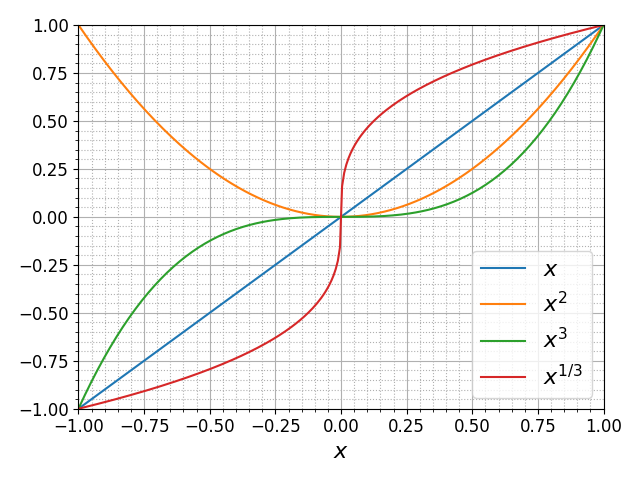

### Логарифмический масштаб

Функции `pyplot.semilogy` и `pyplot.semilogx` выполняют переключение между линейным и логарифмическим масштабами осей. В некоторых случаях логарифмический масштаб позволяет отобразить особенности зависимостей, которые не видны в линейном масштабе. Вот так выглядят графики экспоненциальных функций в линейном масштабе:

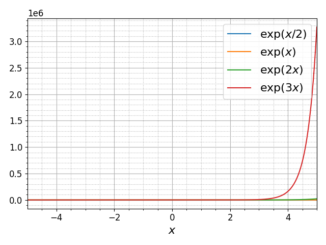

Добавление строки

```py
plt.semilogy()
```

делает график гораздо более информативным:

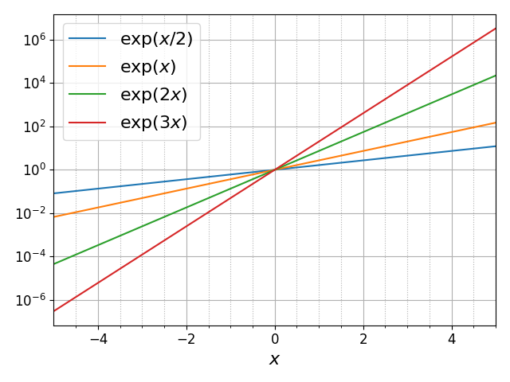

Теперь мы видим поведение функций во всем динамическом диапазоне, занимающем 12 порядков.

### Произвольные отметки на осях

Вернемся к первому примеру, в котором мы строили графики синуса и косинуса. Сделаем так, чтобы на горизонтальной оси отметки соответствовали различным долям числа pi, и имели соответствуеющие подписи:

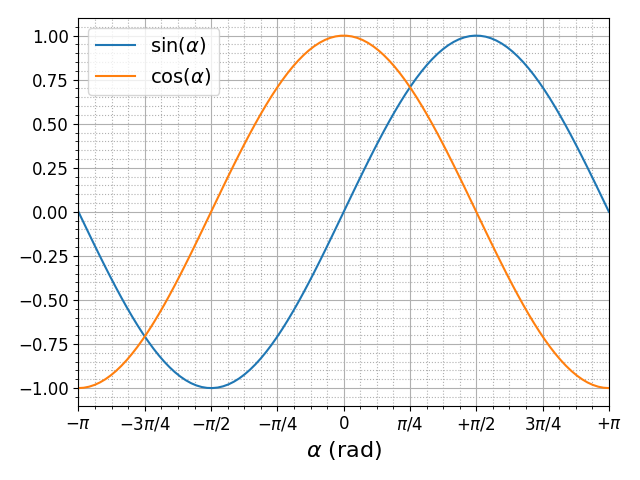

Метки на горизонтальной оси были заданы с помощью функции `pyplot.xticks`:

```py
plt.xticks(
    np.linspace(-np.pi, np.pi, 9),
    [r'$-\pi$', r'$-3\pi/4$', r'$-\pi/2$', r'$-\pi/4$', r'$0$',
     r'$\pi/4$', r'$+\pi/2$', r'$3\pi/4$', r'$+\pi$'])
```

Модуль [`pyplot.ticker`](https://matplotlib.org/api/ticker_api.html) содержит более продвинутые инструменты для управления отметками на осях. Подробности смотрите в [документации](https://matplotlib.org/gallery/ticks_and_spines/tick-locators.html).

### Размер изображения

До сих пор мы строили графики в одном окне, размер которого был задан по умолчанию. За кадром matplotlib создавал объект типа [Figure](https://matplotlib.org/3.3.0/api/_as_gen/matplotlib.figure.Figure.html), который определяет размер окна и содержит все остальные элементы. Кроме того, автоматически создавался объект типа [Axis](https://matplotlib.org/3.1.1/api/axes_api.html). Подробнее работа с этими объектами будет рассмотрена ниже. Сейчас же мы рассмотрим функцию [`pyplot.figure`](https://matplotlib.org/3.3.0/api/_as_gen/matplotlib.pyplot.figure.html), которая позволяет создавать новые объекты типа `Figure` и переключаться между уже созданными объектами.

Функция `pyplot.figure` может принимать множество аргументов. Вот основные:

* `num` уникальный идентификатор объекта типа `int` или `str`. Если задан новый идентификатор, то создается новый объект и он становится активным. В случае, если передан идентификатор уже существующего объекта, то этот объект возвращается и становится активным
* `figsize` - кортеж `(float, float)` - размер изображения в дюймах
* `dpi` - `float` - разрешение в количестве точек на дюйм

Описание других параметров функции `pyplot.figure` можно найти в [документации](https://matplotlib.org/3.3.0/api/_as_gen/matplotlib.pyplot.figure.html). Используем эту функцию и функиую `pyplot.axis` чтобы улучшить наш пример с построением степенных функций:

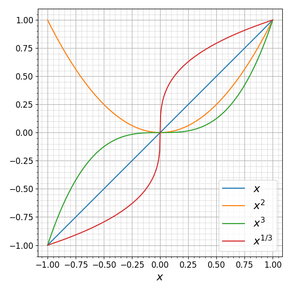

Мы добавили две строки по сравнению с прошлой версией:

```py
fig = plt.figure(figsize=(6, 6))
# ...
plt.axis('equal')
```

Функция [`pyplot.axis`](https://matplotlib.org/api/_as_gen/matplotlib.pyplot.axis.html) позволяет задавать некоторые свойства осей. Ее вызов с параметрос `equal` делает одинаковыми масштабы вертикальной и горизонтальной осей, что кажется хорошей идеей в этом примере. Функция `pyplot.axis` возвращает кортеж из четырех значений `xmin, xmax, ymin, ymax`, соответствующих границам диапазонов значений осей.

Некоторые другие способы использования функции `pyplot.axis`:

* Кортеж из четырех `float` задаст новые значения для границ диапазонов значений осей
* Строка `off` выключит отображение линий и меток осей

## Гистограммы

## Диаграммы рассеяния

## Контурные диаграммы

## Настройка осей

figure и axis, subplots

## Интерактивные графики

## Источники

* [matplotlib.pyplot](https://matplotlib.org/3.1.1/api/_as_gen/matplotlib.pyplot.html)
* [Pyplot tutorial](https://matplotlib.org/3.3.0/tutorials/introductory/pyplot.html)
* [Scipy Lecture Notes](https://scipy-lectures.org/)
